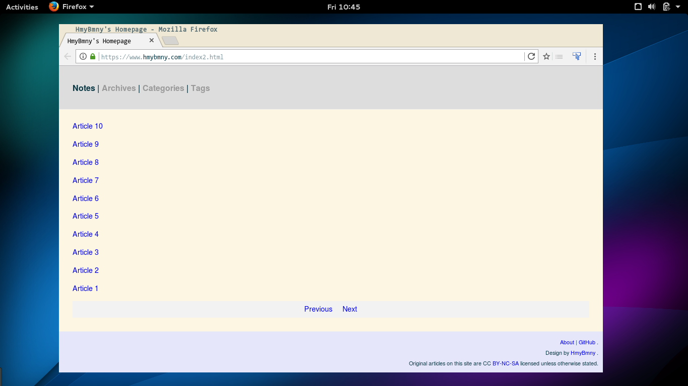

# notes

Pelican 主题，[Demo](http://www.hmybmny.com/)

通过简单地设置，你可以使用 GitHub issues 作为你的评论系统，只需要在 pelicanconf.py 中添加：

```
GITHUB_REPO = '用户名/仓库名'
```

例如：

```
GITHUB_REPO = 'HmyBmny/hmybmny.github.io'
```

然后在你的文章添加属性 issueid，对于 https://github.com/HmyBmny/hmybmny.github.io/issues/1，issueid 的值为 1。所以你的文章属性应为：

```
Title: title
slug: slug
...
issueid: 1
...
```

你可以访问 [netease-cloud-music](http://www.hmybmny.com/posts/linux/2016/Jun/01/netease-cloud-music/) 查看 GitHub issues 作为评论系统的具体效果。


